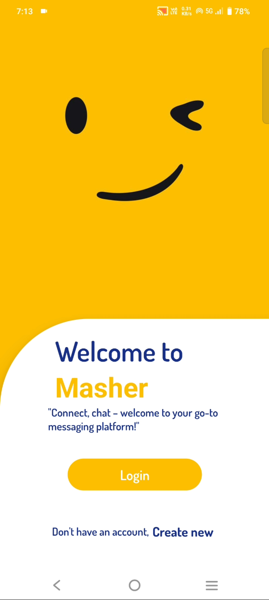
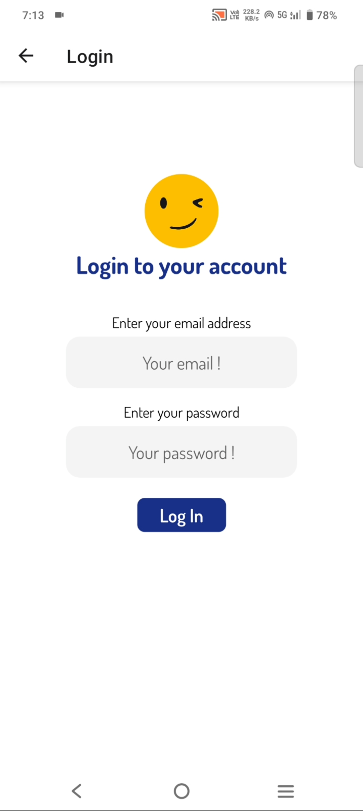
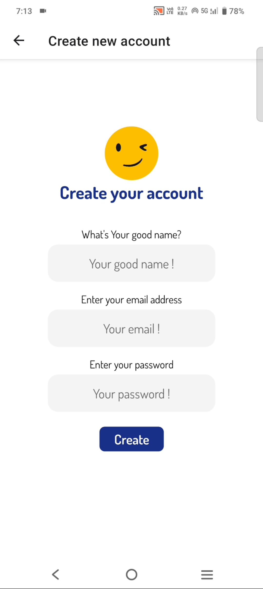
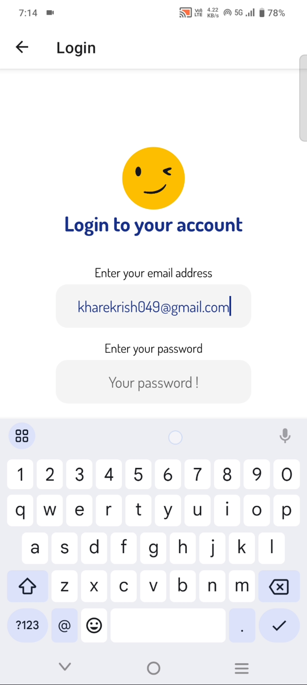
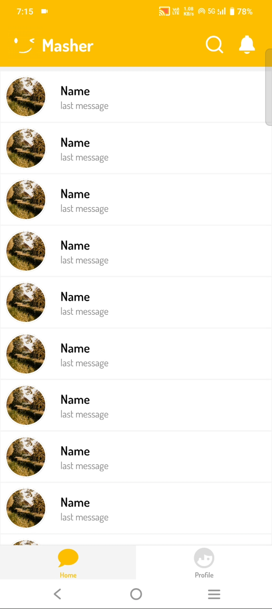
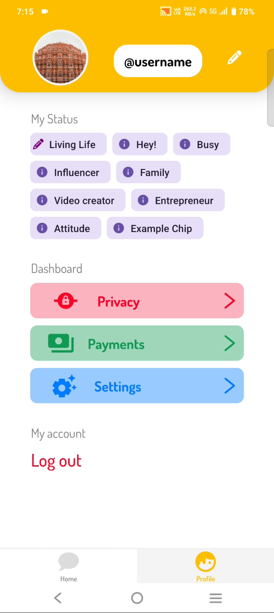
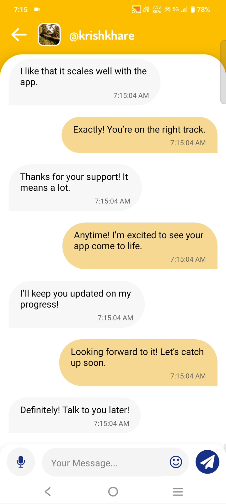
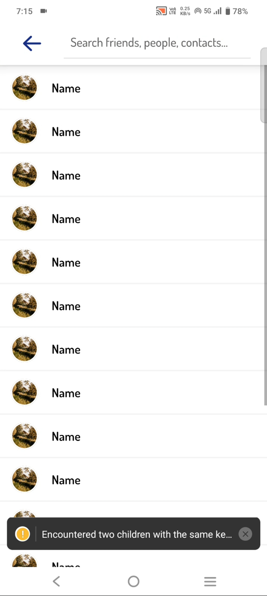

Hi. I am Krish Khare and I am developing mobile chat app application using react native, mongodb, socketio, jwt etc

For this i am keeping backend separate for db server and chat server for scalability and code readability.

Some screeenshots and video giving below of my mobile chat app-

